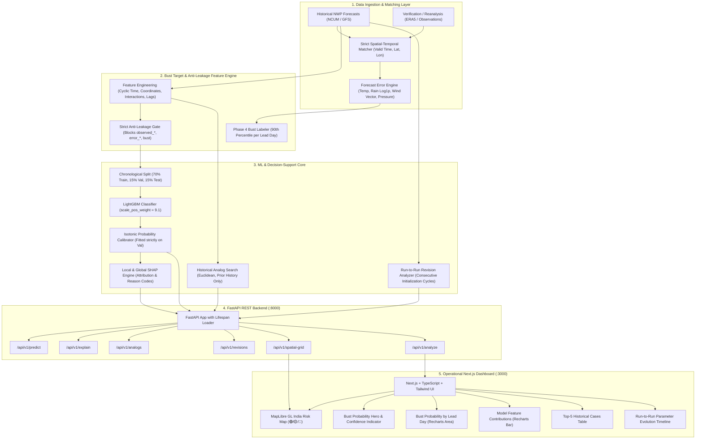

# ForecastGuard AI: Final System Architecture

**Problem Statement ID:** 26079  
**Organization:** Ministry of Earth Sciences (MoES)  
**Department:** National Centre for Medium Range Weather Forecasting (NCMRWF)  
**Application:** AI-Based Forecast Bust Detection for Medium-Range Weather Forecasts  

---

## 1. End-to-End Architecture Diagram

---

## 2. Layer Specifications

### Layer 1: Data Ingestion & Forecast-Observation Matching
- **Input Sources:** Medium-range numerical weather prediction (NWP) forecasts (e.g. NCMRWF NCUM or NOAA GFS) paired with verification data (e.g. IMD ground stations or ECMWF ERA5 reanalysis).
- **Matching Criteria:** Inner join strictly on exact `valid_time`, `latitude`, and `longitude`.
- **Error Calculations:**
  - Temperature: $T_{error} = T_{nwp} - T_{obs}$
  - Rainfall: Log1p absolute deviation $|\log(1 + R_{nwp}) - \log(1 + R_{obs})|$
  - Wind Vector: Pythagorean Euclidean error $\sqrt{(u_{nwp} - u_{obs})^2 + (v_{nwp} - v_{obs})^2}$
  - Combined Normalized Error Score with configurable meteorological weights.

### Layer 2: Target Formulation & Strict Anti-Leakage Gate
- **Forecast Bust Definition:** A binary target where `bust = 1` if `combined_error_score >= P90(lead_day)`.
- **Target Leakage Prevention:** Input feature matrix $X$ strictly forbids any observation variable (`observed_*`), error metric (`error_*`), or target label (`bust`). Any attempt to pass these raises an immediate exception.

### Layer 3: ML Training, Calibration & Interpretability
- **Classifier:** LightGBM Gradient Boosted Decision Trees trained with `scale_pos_weight` to address the ~10% positive class imbalance.
- **Probability Calibration:** Isotonic regression fitted on chronological validation data to guarantee reliable posterior probabilities and minimize Brier score.
- **Explainability:** SHAP (SHapley Additive exPlanations) decomposes single-forecast predictions into positive (risk-increasing) and negative (risk-reducing) forces, mapped to meteorological reason codes.
- **Historical Analogs:** Nearest-neighbor similarity search constrained strictly to past dates ($t_{init} < T_{query}$) to prevent future leakage.
- **Forecast Revision:** Multi-run analysis calculating run-to-run parameter deltas ($T_{-24h} \rightarrow T_{-12h} \rightarrow T_{current}$) to detect numerical forecast instability.

### Layer 4: FastAPI REST API
- Endpoints provide standalone and consolidated access:
  - `GET /api/v1/health`: Service & model status.
  - `GET /api/v1/model`: Hyperparameters, validation, and test metrics.
  - `GET /api/v1/features`: Feature catalog with units and descriptions.
  - `POST /api/v1/predict`: Standalone bust probability and confidence.
  - `POST /api/v1/explain`: Standalone SHAP feature attributions.
  - `POST /api/v1/analogs`: Standalone historical analog retrieval.
  - `POST /api/v1/revisions`: Standalone run-to-run forecast revision tracking.
  - `POST /api/v1/analyze`: Unified decision-support payload.
  - `GET /api/v1/spatial-grid`: Region-wise station bust probabilities for Day 1 to 10 across India.

### Layer 5: Operational Decision-Support Dashboard
- **Tech Stack:** Next.js 16 (Turbopack), TypeScript, Tailwind CSS, MapLibre GL JS, Recharts, Lucide React.
- **Map:** Dynamic dark-matter base map with colored station markers representing model-estimated bust risk.
- **Charts:** Interactive Lead Day uncertainty curve (Day 1 to 10) and SHAP feature attributions.
- **Demonstration Preset:** One-click Waranga Day 5 case loader for operational evaluation.

